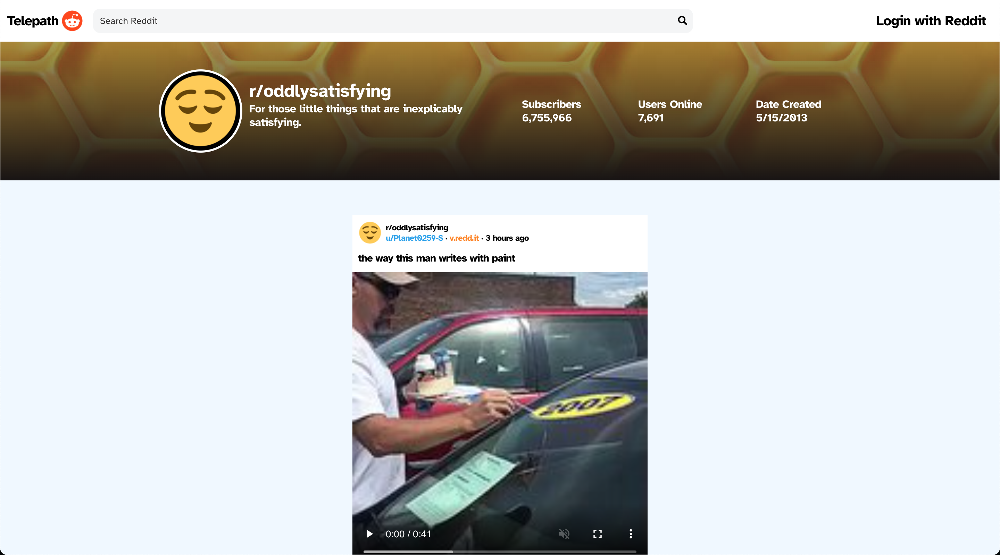

# **Telepath For Reddit**

**Telepath is a web client & application for Reddit users to view videos & gifs from subreddits they follow**

### Primary Technology Stack
- React.js
- Node.js
- Express.js
- Snoowrap.js

# 
## Preview


#

## Commands
* Cloning the repository
```bash
git clone https://github.com/oscar-oneill/telepath.git

cd telepath
```

* Installing dependencies (in separate terminals)
```bash
cd server

npm install

# auto-restarts server when javascript files change
npm run dev

# Server is now live on http://localhost:5500
```

```bash
cd client

npm install

# Opens application in the browser at http://localhost:3000
npm start
```

#

## Loggin In With Reddit
*This app works best when you're logged into your reddit account. To do this you need to create an app on reddit.*

1. Go to https://old.reddit.com/prefs/apps/
2. Click the 'are you a developer? create an app' button
3. Configure Your Application
    * Give your app a name
    * Select web app
    * Description and url do not need to be specified yet and you can update it later
    * Type in http://localhost:3000 into redirect uri, this will redirect you/users to back to the application with your credentials

4. Add the credentials of your reddit account and your newly created app into a `.env` file in the **root** of the server folder

Your `.env` file should contain the following:

```bash
userAgent=yourAppsName
clientId=yourAppsClientID
clientSecret=yourAppsSecret
username=yourRedditUsername
password=yourRedditPassword
redirectUri=http://localhost:3000
```

**Remember to update the redirect uri in the `.env` file and on reddit when you deploy this application online with the proper urls.**